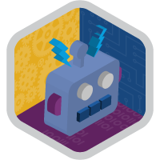
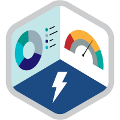
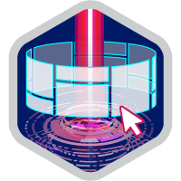

# :man_technologist:

## Eae meu povo!!👋

Meu nome é Cícero Roniel, Formado em Sistemas de Informação.

- :man_technologist: Desenvolvedor Salesforce 
- :blue_heart: Techs: Node.js, PHP(Laravel), Salesforce(Com foco em Apex, LWC, Config de ambiente), !
- :books: Estudando sobre Salesforce, React, AWS, GCP, GraphQL  :heart:

> :octocat: [https://ciceroroniel.github.io/curriculo/](https://ciceroroniel.github.io/curriculo/)

    
    
    
    
    
    

